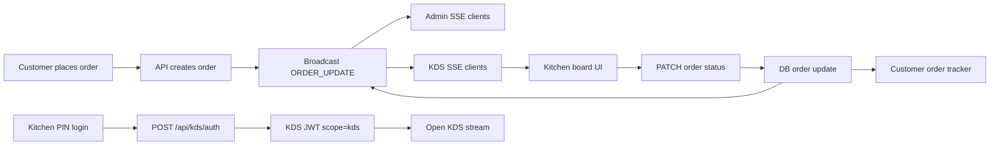

# Kitchen Display System (KDS) Workflow

This document defines how KDS should work in OpenDining, including:
- the current implementation (v1)
- the target implementation (v2)
- implementation checklist and test flow

## Goal

Provide a fast, kitchen-friendly order board where staff can:
1. Sign in quickly using a PIN
2. See live incoming orders without page refresh
3. Move orders through kitchen statuses reliably
4. Stay isolated from admin-owner privileges

## Scope

In scope:
- KDS access control
- KDS live order stream
- KDS status update actions
- KDS failure handling and reconnect behavior

Out of scope:
- POS printing integrations
- Multi-station kitchen routing (grill/bar/dessert lanes)
- Hardware-specific kiosk provisioning

## Current State (implemented)

What exists now:
- Restaurant settings can store KDS PIN (4-6 digits) in restaurants.kds_pin.
- Dedicated KDS PIN auth endpoint exists: POST /api/kds/auth.
- Scoped KDS endpoints exist for stream and status update:
   - GET /api/kds/:restaurantId/orders/stream
   - PATCH /api/kds/:restaurantId/orders/:orderId/status
- Admin frontend includes a KDS page route: /kitchen/:restaurantSlug.
- KDS helper tests exist in admin frontend.

What is still pending:
- API unit/integration tests for KDS routes.
- Full E2E coverage of KDS happy and failure paths.

## Target Workflow (v2)

### 1) Setup by owner/admin

1. Owner opens Settings.
2. Owner sets or rotates Kitchen Display PIN (4-6 digits).
3. API validates PIN format and stores it for the restaurant.
4. Owner shares only the PIN with kitchen staff.

Expected result:
- Kitchen can authenticate without owner credentials.

### 2) Kitchen sign-in

1. Kitchen device opens KDS URL (example: /kitchen/:restaurantSlug).
2. Staff enters PIN.
3. Frontend calls POST /api/kds/auth with restaurant context + PIN.
4. API validates PIN against restaurant record.
5. API returns short-lived KDS token (JWT with scope=kds).
6. Frontend stores KDS token in session storage and enters board view.

Expected result:
- Staff can access only KDS features.

### 3) Live order board

1. Frontend opens SSE stream using KDS token:
   - GET /api/kds/:restaurantId/orders/stream
2. API verifies KDS token scope and restaurant binding.
3. API sends initial snapshot of active orders.
4. API pushes ORDER_UPDATE events for new/changed orders.

Expected result:
- Kitchen sees near-real-time updates without manual refresh.

### 4) Kitchen actions

1. Staff clicks status actions on an order card.
2. Frontend calls PATCH /api/kds/:restaurantId/orders/:orderId/status.
3. API validates:
   - token scope is kds
   - token restaurantId matches route restaurantId
   - requested status is allowed
4. API persists status change and broadcasts update to:
   - KDS stream
   - Admin stream
   - customer order tracking stream

Expected result:
- One source of truth for status across all views.

### 5) Session and failure behavior

1. Token expires -> frontend shows PIN screen again.
2. SSE disconnect -> frontend retries with backoff.
3. Invalid PIN -> show clear inline error and keep user on PIN screen.
4. Unauthorized/forbidden API responses -> clear KDS token and force re-auth.

Expected result:
- Kitchen can recover from common network/session failures quickly.

## Security Rules

1. KDS token must be scope-limited (scope=kds).
2. KDS token must not authorize admin endpoints.
3. Admin token should not be accepted on KDS-only endpoints once v2 is complete.
4. KDS token should have short TTL (recommended: 8h).
5. Every KDS mutation must enforce restaurantId match.

## API Contract (v2)

1. POST /api/kds/auth
- Body: { restaurantId: string, pin: string }
- 200: { token: string, expiresIn: string }
- 401: INVALID_PIN
- 404: RESTAURANT_NOT_FOUND

2. GET /api/kds/:restaurantId/orders/stream
- Auth: Bearer kds token
- Stream payloads:
  - { type: "SNAPSHOT", orders: [...] }
  - { type: "ORDER_UPDATE", order: {...} }

3. PATCH /api/kds/:restaurantId/orders/:orderId/status
- Auth: Bearer kds token
- Body: { status: "confirmed" | "preparing" | "ready" | "served" | "cancelled" }

## Data Flow Diagram

## Implementation Checklist

### Backend (apps/api)

1. Add POST /api/kds/auth (PIN auth).
2. Add requireKdsAuth middleware with scope check.
3. Add GET /api/kds/:restaurantId/orders/stream (KDS token).
4. Add PATCH /api/kds/:restaurantId/orders/:orderId/status.
5. Ensure SSE broadcasts include both admin and KDS channels.
6. Add unit tests for auth, scope, mismatch, expiry, and status updates.

### Admin Frontend (apps/admin)

1. Add route: /kitchen/:restaurantSlug.
2. Add KDS PIN screen with numeric keypad.
3. Add KDS board with oldest-first order cards.
4. Add action buttons by status transition.
5. Add reconnect and expired-session handling.
6. Add basic accessibility checks (focus, labels, error announcements).

### QA/E2E

1. Wrong PIN blocks access.
2. Correct PIN grants KDS board access.
3. New order appears live on board.
4. Status update propagates to admin and customer tracking.
5. KDS token cannot call admin endpoints.

## Rollout Plan

1. Phase 1: Add KDS auth and scoped endpoints. Completed.
2. Phase 2: Ship KDS frontend route and consume scoped endpoints. Completed.
3. Phase 3: Remove v1 admin-JWT dependency for KDS access. Completed.
4. Phase 4: Harden logging/metrics and complete regression suite. Pending.

## Definition of Done

1. Kitchen can work end-to-end using only KDS PIN.
2. No admin credentials are needed on kitchen devices.
3. Status changes propagate in real time to all relevant clients.
4. Security tests prove scope isolation and restaurant isolation.
5. E2E tests pass for happy path and key failure paths.
